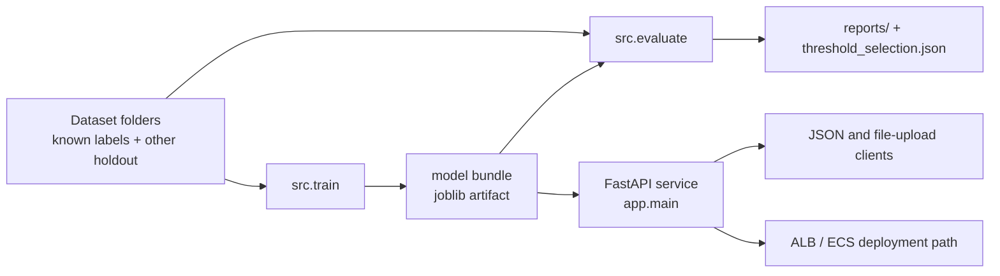

# Document Classifier

A production-style document classification service for topical text
documents. It trains a sparse TF-IDF + LogisticRegression model, wraps
the trained pipeline in a small joblib bundle, and serves predictions
through FastAPI with confidence-based routing to an `other` fallback.

The dataset contains ten trained labels:

`business`, `entertainment`, `food`, `graphics`, `historical`,
`medical`, `politics`, `space`, `sport`, `technology`.

The source folder typo `technologie` is normalized to `technology`.
The `other` folder is not trained as a class; it is used only as an
out-of-distribution holdout to test fallback behavior.

## Start Here

### Quickstart (clean clone, no dataset download)

A fresh clone is functional on its own — a small synthetic sample corpus is
committed at `data/sample`, so you can train a working "smoke" model and
serve predictions without fetching the assessment dataset.

```bash
# Option A — Docker (the image trains a smoke model from data/sample at build time)
make docker-build && make docker-run
# -> POST http://localhost:8000/classify_document is live

# Option B — local
make install        # uv sync --dev
make sample-model   # train a smoke model on data/sample -> models/document_classifier.joblib
make serve          # run the API
```

The smoke model has limited accuracy by design (it is trained on a handful of
synthetic documents). For the full-accuracy model, see **Models: two tiers**
below and run `make bootstrap`.

### Run with the full dataset

If you have the assessment dataset (or want it downloaded), pick whichever
matches your situation — all paths produce the full-accuracy model and the
`--loco` evaluation reports:

```bash
# You have it as a local folder or zip — no download:
DATA_SRC=~/Downloads/trellis_assessment_ds make bootstrap
DATA_SRC=~/Downloads/trellis.zip          make bootstrap

# It's already placed at data/trellis_assessment_ds:
make full-model           # train + evaluate, no download
# (or: make train && make evaluate ARGS=--loco)

# You don't have it — download from the case-study link, then train + evaluate:
make bootstrap
```

Then `make serve` to start the API. `make bootstrap` skips the download if the
dataset is already present (use `FORCE=1` to re-acquire).

### Then

1. Read the API details in `docs/readme_api.md` and the deployment plan in `infra/README.md`.
2. Inspect `reports/` and `notebooks/` for the evidence behind the README claims.

## Documentation Map

- `README.md` — canonical overview of the system, setup, evaluation summary, and operating model.
- `docs/readme_api.md` — API-focused usage, configuration, auth, and request/response behavior.
- `docs/readme_model.md` — model-training and evaluation narrative, dataset handling, and threshold policy.
- `infra/README.md` — AWS deployment design, scaling path, and security/operations notes.
- `reports/` — committed evaluation artifacts quoted by this README.
- `notebooks/` — reviewer-facing exploratory analysis, model comparison, and error analysis.

## System Overview



## Setup

```bash
uv sync
```

### Models: two tiers

The repo deliberately does not commit large binaries or the proprietary
assessment dataset. To keep a clean clone functional anyway, it ships two
tiers:

| Tier | Trained on | How to get it | Use |
|---|---|---|---|
| **Smoke model** | `data/sample` (committed synthetic corpus) | `make sample-model`, or baked into the Docker image at build time | Out-of-the-box demo, local dev, CI, container smoke tests |
| **Full model** | `data/trellis_assessment_ds` (downloaded) | `make bootstrap` | Real accuracy; production |

Both produce the identical bundle contract at
`models/document_classifier.joblib`, so the API and `src.predict` behave the
same regardless of which tier is loaded. The trained artifact is gitignored
(`models/*.joblib`); it is reproduced, not committed.

### Sample corpus (committed)

`data/sample/` holds a small, fully synthetic corpus — a handful of short
documents per trained label plus a couple of `other` holdout files. It exists
only so a clean clone can train a smoke model and serve predictions with no
external download. It is not the assessment dataset and is not meant for
accuracy claims.

### Full dataset (not committed)

The assessment dataset is not committed. `make bootstrap` downloads it,
arranges the category folders at `data/trellis_assessment_ds/`, trains, and
evaluates. To place it manually instead (the `data/` folder is kept in git via
`.gitkeep`, but its non-sample contents are gitignored):

```
data/
├── sample/                      # committed synthetic smoke corpus
└── trellis_assessment_ds/       # the assessment dataset (not committed)
    ├── business/        *.txt
    ├── entertainment/   *.txt
    ├── ...
    ├── technologie/     *.txt   # aliased to "technology" at load time
    └── other/           *.txt   # OOD holdout — never used for training
```

All pipeline commands default to `--data-dir data/trellis_assessment_ds`,
so once the files are in place they run with no extra flags. Override
`--data-dir` if your dataset lives elsewhere (e.g. `--data-dir data/sample`).

Train the model bundle:

```bash
uv run python -m src.train \
  --output models/document_classifier.joblib \
  --report-dir reports
```

Generate evaluation reports and tune thresholds (recreates every file in
`reports/`, including `misclassified_examples.csv` and
`other_holdout_predictions.csv`):

```bash
uv run python -m src.evaluate \
  --model-path models/document_classifier.joblib \
  --report-dir reports
```

Run the API:

```bash
uv run uvicorn app.main:app --host 0.0.0.0 --port 8000 --workers 4
```

Interactive API docs are available at `http://localhost:8000/docs`.

By default the API is configured for server-to-server use behind a load
balancer. Browser origins are denied unless
`SECURITY__CORS_ALLOWED_ORIGINS` is set to an explicit allowlist.

For bulk synchronous inference, use `POST /classify_documents` instead
of sending one HTTP request per document. The request is capped at 100
documents by default (`API__MAX_BATCH_SIZE`) so memory and latency stay
bounded.

Request-body guardrails are configurable via Dynaconf environment
variables such as `API__MAX_FILE_UPLOAD_BYTES`,
`API__UPLOAD_CHUNK_SIZE_BYTES`, `API__MULTIPART_OVERHEAD_BYTES`, and
`API__MAX_REQUEST_BYTES`.

Run with Docker when you want a production-like container for the API
service instead of the local `uv` workflow:

```bash
docker build -t document-classifier .   # multi-stage: trains a smoke model from data/sample
docker run --rm -p 8000:8000 document-classifier
```

The image is functional on its own: the build stage trains a smoke model
from the committed `data/sample` corpus and bakes it in, so the container
classifies immediately with no volume mount or download.

To serve the **full-accuracy** model in production, override the baked-in
artifact by mounting a real bundle and pointing `MODEL_PATH` at it:

```bash
docker run --rm -p 8000:8000 \
  -e MODEL_PATH=/app/models/document_classifier.joblib \
  -v "$PWD/models:/app/models:ro" \
  document-classifier
```

`MODEL_PATH` also lets deployments load the artifact from S3-synced storage.
If the configured artifact is missing or corrupt, the API still starts in
degraded mode (`/health` reports `model_loaded: false`, classification
returns 503) rather than crash-looping.

Use the container for serving the API. Training and evaluation remain
best run from the source checkout with `uv run python -m src.train` and
`uv run python -m src.evaluate`.

An AWS deployment plan is documented in `infra/README.md`. It outlines
ECS Fargate, ECR, ALB, Secrets Manager, CloudWatch Logs, S3 model
artifacts, autoscaling, and a queue-backed worker path for
million-document backfills.

## Model Decision Summary

Model selection in `notebooks/02_model_experiments.ipynb` uses 5-fold
stratified cross-validation for a stable comparison on a small corpus.
The reproducible training path then uses a fixed stratified 70/15/15
split: train fits the selected model, validation tunes confidence
thresholds, and test reports final held-out metrics.

| Model | CV accuracy | CV macro F1 | Median ms/doc | Batch docs/sec | Size MB |
|---|---:|---:|---:|---:|---:|
| TF-IDF + LogisticRegression | 0.9788 | 0.9789 | 0.26 | 6792.06 | 3.28 |
| TF-IDF + MultinomialNB | 0.9778 | 0.9776 | 0.43 | 6721.01 | 5.80 |
| TF-IDF + Calibrated LinearSVC | 0.9819 | 0.9818 | 1.92 | 6187.01 | 13.36 |

The calibrated LinearSVC is slightly ahead on CV macro F1, but the
difference is small and it is slower and larger. MultinomialNB is fast
but less useful for confidence routing. LogisticRegression is the best
production baseline here: simple, compact, fast, and accurate.

Final held-out LogisticRegression test metrics:

| Metric | Value |
|---|---:|
| Accuracy | 0.9933 |
| Macro F1 | 0.9933 |
| Weighted F1 | 0.9933 |

Detailed artifacts:

- `reports/model_comparison_cv.csv`
- `reports/classification_report.txt`
- `reports/confusion_matrix.csv`
- `notebooks/03_error_analysis.ipynb`

## Out-Of-Distribution Routing (`other`)

The model predicts one of the ten known labels. `src.predict.predict_text`
then applies confidence thresholds from the bundle:

| Threshold | Value |
|---|---:|
| `auto_accept` | 0.90 |
| `manual_review` | 0.70 |
| `other` | 0.15 |

Because `other` is assigned by thresholding the top probability, the OOD
detector here *is* the max-softmax-probability (MSP) baseline. The right
way to judge it is therefore threshold-independent, not at a single catch
rate.

### How good is the detector? (threshold-independent)

Measured on the leave-one-class-out (LOCO) probe — each known class is
held out of training in turn and treated as pseudo-OOD (992 pooled
pseudo-OOD docs vs. 1,340 known docs):

| Metric | Value |
|---|---:|
| OOD score | `1 - max_softmax_probability` |
| **AUROC** | **≈ 0.95** |
| AUPR | high (see `reports/ood_auc.json`) |

An AUROC of ~0.95 means the score separates OOD from known documents
well. The single shipped catch rate below is **one operating point on
this curve, not the quality of the detector.** The exact AUROC/AUPR are
computed from pooled per-document scores and written to
`reports/ood_auc.json` (with the full frontier in
`reports/ood_loco_curve.csv`) by `python -m src.evaluate --loco`.

### Why 0.15? (the operating-point choice)

LOCO frontier — catch rate vs. known-class misroute across thresholds
(`reports/ood_loco_curve.csv`):

| `other` threshold | Known misroute % | Pseudo-OOD caught % |
|---:|---:|---:|
| 0.15 (shipped) | 0.75% | 27.6% |
| 0.20 | 8.5% | 81.3% |
| 0.25 | 15.9% | 96.1% |
| 0.30 | 29.7% | 99.6% |

This is a **deliberate high-precision operating point.** There is a sharp
cliff between 0.15 and 0.20: catch rate jumps from 27.6% to 81.3%, but
known-class misroutes jump from 0.75% to 8.5%. The selection rule
(`choose_other_threshold`) maximizes OOD catch subject to a hard
`max_known_misroute_pct = 5%` guardrail, which forbids 0.20 and pins the
threshold at 0.15. In other words, `other` is tuned to **almost never
mislabel a real document as `other`**, at the cost of letting some novel
documents through as a low-confidence known label.

That trade is a product decision, not a fixed property of the model: if
the deployment can tolerate more false `other` (e.g. a human-review
queue), raising the guardrail to ~10% moves the threshold to 0.20 and
lifts OOD catch to ~81%. The threshold lives in `config/model.toml` so
this is a one-line change, re-tuned and re-measured by re-running
evaluation.

The six-file `other` holdout (all 6 routed to `other`) is kept only as a
smoke check; it is too small to bound the trade-off, which is why the
LOCO probe above is the primary OOD evidence.

### Limitation and next step

MSP is a deliberately simple OOD signal: it caps how much catch is
available at a given precision. A score computed directly on the document
representation — Mahalanobis distance or an energy score over the TF-IDF
features or a sentence embedding — would typically push the whole frontier
up (more catch at the same misroute rate). That is the clear next
investment if OOD recall becomes a product requirement; it is left out
here to keep the baseline honest and the pipeline cheap.

## Confidence Ranges

Validation confidence buckets:

| Confidence range | Total | Correct | Accuracy |
|---|---:|---:|---:|
| [0.0, 0.5) | 118 | 114 | 0.9661 |
| [0.5, 0.6) | 18 | 18 | 1.0000 |
| [0.6, 0.7) | 11 | 11 | 1.0000 |
| [0.7, 0.8) | 1 | 1 | 1.0000 |
| [0.8, 0.9) | 1 | 1 | 1.0000 |
| [0.9, 1.0] | 0 | 0 | n/a |

Low confidence does not mean the model is usually wrong: most
validation examples are below 0.5 confidence and still reach 96.61%
accuracy. The confidence policy is a routing policy, not a claim of
perfect calibration.

## Scaling To Millions Of Documents

Measured local inference benchmark:

| Benchmark | Value |
|---|---:|
| Median single-document latency | 0.3282 ms |
| p95 single-document latency | 0.5489 ms |
| Batch throughput | 4876.28 docs/sec |
| Batch size used | 149 docs |
| Serialized bundle size | 2.07 MB |

Sparse linear inference is CPU-only, compact, and easy to scale
horizontally. The API is stateless: each worker loads its own read-only
model bundle, so additional workers or replicas can be added behind a
load balancer without coordination or sticky sessions.

For bulk backfills, a batch endpoint would improve throughput by
amortizing HTTP, JSON, vectorization, and model-call overhead. For
millions of documents, the next step would be asynchronous job
processing: queue batches through workers, write results to storage, and
use the API for job submission/status rather than one huge synchronous
request. Transformer or LLM-based approaches could be useful for harder
semantic or OOD cases, but they would be materially more expensive and
slower for this topical news-style task.

## API

### `GET /health`

Returns service liveness and model availability:

```json
{"status": "ok", "model_loaded": true}
```

The endpoint still returns 200 when the model is unavailable so
operators can distinguish process health from artifact loading.

### `POST /classify_document`

Request:

```json
{
  "document_text": "The company reported stronger quarterly earnings...",
  "top_k": 3
}
```

Response:

```json
{
  "message": "Classification successful",
  "label": "business",
  "raw_label": "business",
  "confidence": 0.1985,
  "decision": "manual_review",
  "top_k": [
    {"label": "business", "confidence": 0.1985},
    {"label": "space", "confidence": 0.1022},
    {"label": "graphics", "confidence": 0.1015}
  ]
}
```

Example curl:

```bash
curl -X POST http://localhost:8000/classify_document \
  -H "Content-Type: application/json" \
  -d '{"document_text": "The company reported stronger quarterly earnings as investors reacted to higher revenue and profit forecasts.", "top_k": 3}'
```

### `POST /classify_documents`

Batch endpoint for synchronous bulk classification. This endpoint makes
one vectorized model call for the submitted texts, reducing HTTP and
model overhead compared with many single-document calls.

Request:

```json
{
  "documents": [
    {"id": "doc-1", "document_text": "The company reported stronger quarterly earnings..."},
    {"id": "doc-2", "document_text": "The striker scored twice in the final..."}
  ],
  "top_k": 3
}
```

Response:

```json
{
  "message": "Batch classification successful",
  "total": 2,
  "results": [
    {
      "document_id": "doc-1",
      "label": "business",
      "raw_label": "business",
      "confidence": 0.1985,
      "decision": "manual_review",
      "top_k": [
        {"label": "business", "confidence": 0.1985}
      ]
    }
  ]
}
```

### `POST /classify-file`

Multipart `.txt` upload endpoint. The file is decoded as UTF-8 with
invalid bytes ignored, then classified through the same path as the JSON
endpoint.

```bash
curl -X POST "http://localhost:8000/classify-file?top_k=3" \
  -F "file=@article.txt"
```

### Response Statuses

| Status | When | Body |
|---|---|---|
| 200 | Classification succeeded | `ClassificationResponse` |
| 400 | Whitespace-only text or non-`.txt` upload | `{"detail": "document_text must not be empty"}` |
| 401 | API key missing or invalid when enabled | `{"detail": "Invalid or missing API key"}` |
| 413 | Raw request/upload exceeds configured byte limits | `{"detail": "Request body exceeds ... bytes"}` |
| 422 | Schema validation failure | FastAPI validation detail |
| 503 | Model artifact missing or unloadable | `{"detail": "Model is unavailable"}` |
| 500 | Unexpected inference failure | `{"detail": "Unexpected classification error"}` |

## Configuration

Settings live in `config/settings.toml` and are loaded with Dynaconf.
Select an environment with `ENV_FOR_DYNACONF` and override nested values
with double-underscore environment variables:

```bash
ENV_FOR_DYNACONF=production
MODEL_PATH=/opt/models/classifier_v2.joblib
API__MAX_DOCUMENT_LENGTH=50000
API__MAX_FILE_UPLOAD_BYTES=200000
API__MAX_REQUEST_BYTES=20000000
API__MAX_BATCH_SIZE=100
API__DEFAULT_TOP_K=5
LOGGING__LEVEL=DEBUG
LOGGING__JSON=false
SECURITY__API_KEY_ENABLED=true
SECURITY__API_KEY=change-me
SECURITY__CORS_ALLOWED_ORIGINS='["https://app.example.com"]'
```

`MODEL_PATH` is resolved at load time, with the environment variable
taking precedence over `config/settings.toml`.

## Logging And Operations

The API configures logging in `app/logging.py` from Dynaconf
`settings.logging.*`. Production defaults to one JSON log line per
request; development can use console logs by setting
`ENV_FOR_DYNACONF=development` or `LOGGING__JSON=false`.

Request logs include request ID, method, path, status code, latency,
predicted label, confidence, decision, text length, and SHA-256 text
hash. Raw document text is never logged.

API-key protection is optional and disabled by default for local
evaluation. Enable it in deployed environments with
`SECURITY__API_KEY_ENABLED=true` and send the key in `X-API-Key`.
`/health` remains unauthenticated for platform health checks.
`SECURITY__CORS_ALLOWED_ORIGINS` can be set to an explicit browser
origin allowlist when the API is called directly from front-end clients.
Responses also include `X-Content-Type-Options`, `Referrer-Policy`, and
`X-Frame-Options`; HSTS remains an edge concern owned by the public TLS
terminator.

A missing or corrupt model artifact does not crash the service. The app
stays up, `/health` reports `model_loaded: false`, and classification
requests return 503.

## Quality Gates

Run every gate locally:

```bash
uv run ruff format . --check
uv run ruff check .
uv run basedpyright
uv run pip-audit
uv run pytest -q                 # fast suite (integration excluded by default)
uv run pytest -m integration     # real artifact + dataset, end-to-end
```

Current gate results:

- Ruff format/check: pass
- basedpyright: pass
- pip-audit: no known vulnerabilities found
- pytest: 60 passed (fast suite); 12 passed (integration). One third-party
  deprecation warning from Starlette.

### Continuous integration

The same gates run automatically on every push to `main` and every pull
request via GitHub Actions (`.github/workflows/ci.yml`), as parallel jobs so
each failure is isolated:

- `lint` — `ruff check` + `ruff format --check`
- `typecheck` — `basedpyright`
- `test` — fast `pytest` suite
- `audit` — `pip-audit`
- `docker` — builds the image, smoke-tests `/health`, and pushes to GHCR on `main`
- `integration` — real-artifact suite, non-blocking (the artifact/dataset may
  not be committed, in which case the tests skip)

## Jupyter Workflow

The notebooks are reviewer-facing analysis artifacts:

- `notebooks/01_dataset_exploration.ipynb`
- `notebooks/02_model_experiments.ipynb`
- `notebooks/03_error_analysis.ipynb`

Run Jupyter locally with:

```bash
uv run jupyter lab
```

Notebook outputs are committed where they support the model decision.
Source, app, and tests are covered by Ruff and basedpyright; notebooks
are excluded from Ruff because they include path setup cells and
narrative analysis rather than importable modules.

## Future Improvements

- Add rate limiting at the service or gateway layer.
- Add async job processing for million-document backfills.
- Add Terraform modules once AWS account, VPC, domain, and deployment
  constraints are known.
- Collect a larger, representative OOD set and retune fallback routing.
- Add model/version metadata to `/health`.
- Export Prometheus metrics for latency, throughput, and decision mix.
- Add Docker Compose for local API smoke testing with mounted artifacts.

### Data flywheel: capture submissions for evaluation and retraining

Persist the documents submitted to `/classify_document` (with the model's
prediction, confidence, decision, and model version) so production traffic
becomes a growing, real-world dataset for re-evaluation and retraining. This
closes the loop with the OOD work above: the highest-value samples to capture
and label are exactly the **low-confidence and `other`-routed** documents —
they reveal new topics, drift, and the failure modes that the synthetic LOCO
probe only approximates. Concretely:

- **Storage**: write submissions asynchronously (e.g. to object storage / a
  queue) so capture never adds latency to the request path; store the text
  plus prediction metadata, keyed by a content hash for dedup.
- **Labeling loop**: route low-confidence and `other` cases to a human-review
  queue; confirmed labels feed both a held-out evaluation set (to track real
  accuracy over time) and the next training run.
- **Drift monitoring**: track the decision mix and confidence distribution
  over time; a rising `other`/low-confidence rate is an early signal that the
  label set or model needs updating.

This must be designed privacy-first: explicit consent / opt-out, PII handling
and minimization, a defined retention policy, encryption and access controls,
and per-tenant data isolation. Capturing user content is a data-governance
decision, not just an engineering one — so it is scoped here as a deliberate
next step rather than switched on by default.
